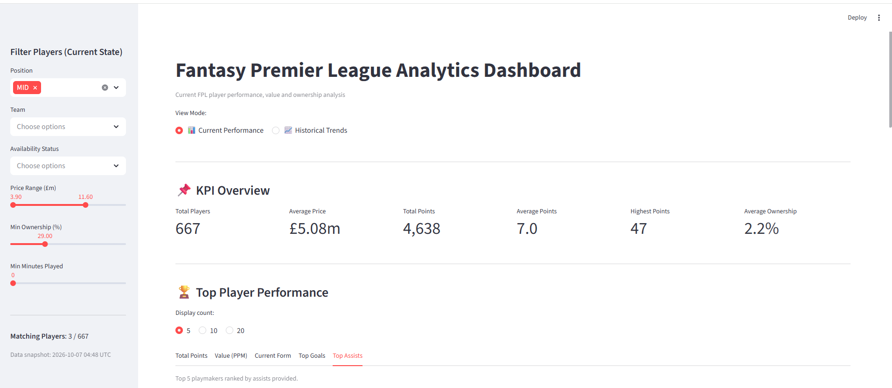
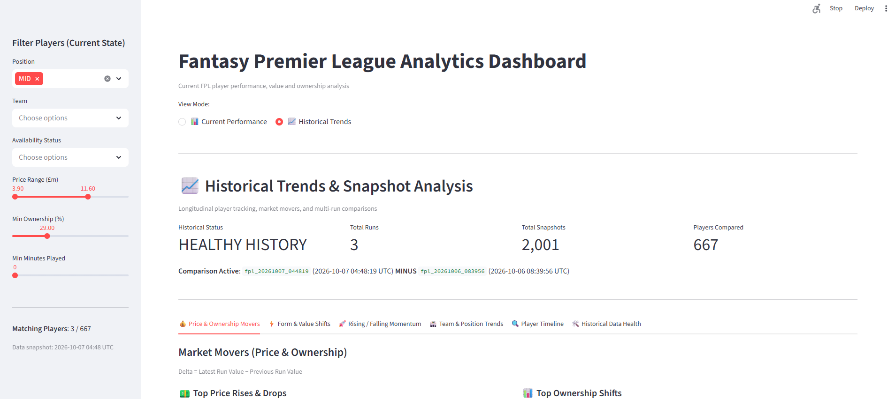
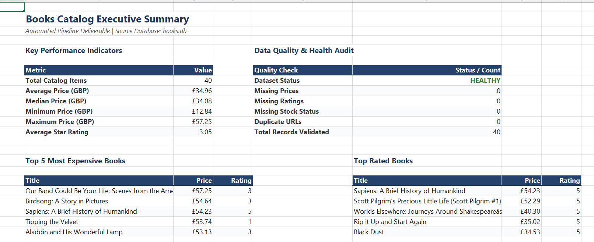
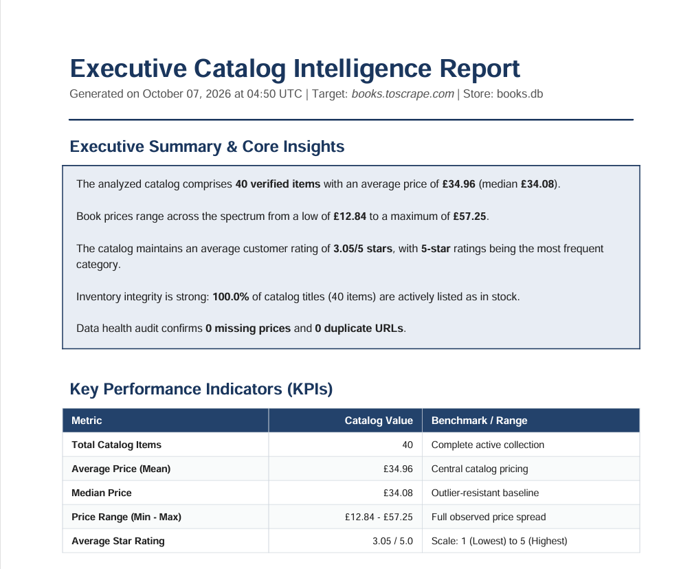
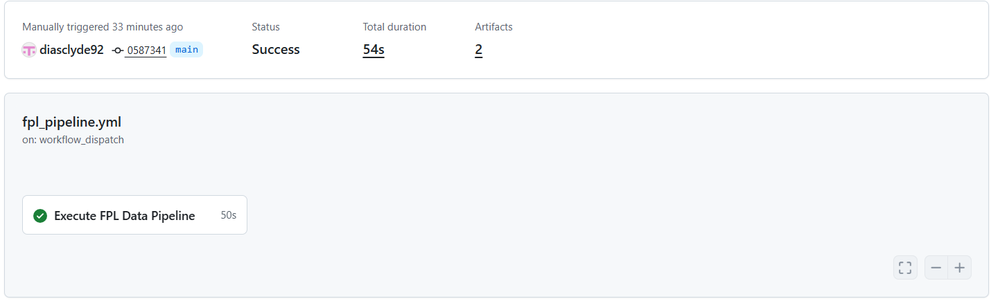

# FPL Data Automation & Analytics Pipeline

A portfolio-grade end-to-end data engineering and automation system demonstrating reliable web and API data extraction, strict schema validation, relational persistence, vectorized Pandas analytics, professional business reporting (Excel and executive PDF), interactive web visualization with Streamlit, and scheduled data automation via GitHub Actions with cross-run state continuity.

---

## Overview

Modern organizations require dependable, hands-off automation systems: extracting dynamic web and API datasets reliably, enforcing data quality rules, tracking historical state across time, and translating raw records into actionable deliverables—including spreadsheet models, executive briefing documents, and live interactive dashboards.

This project was built to demonstrate that complete lifecycle with production-level engineering rigor. Rather than serving as an isolated, one-off web scraper or a static analytical notebook, this repository models a fully integrated, modular data engineering pipeline. It solves the real-world challenge of monitoring frequently updating external data sources (demonstrated with the Fantasy Premier League public API and a complementary multi-page e-commerce catalog), preserving immutable historical audit trails, computing longitudinal momentum and pricing shifts, and orchestrating unattended daily runs.

---

## What This Project Demonstrates

- **Resilient Web & API Extraction**: Modular HTTP layer featuring custom header simulation, connection timeouts, and exponential backoff retries for transient HTTP errors (`429`, `5xx`).
- **Reusable Pipeline Architecture**: Clean separation of ingestion, parsing, domain modeling, relational persistence, analytical processing, and client presentation.
- **Pagination & Raw Ingestion Capture**: Robust multi-page link traversal with cycle/loop protection and immutable raw staging (HTML/JSON) under timestamped run IDs.
- **Typed Schema Validation**: Pydantic v2 domain schemas validating constraints, boundary conditions, and types, isolating invalid records without terminating the pipeline.
- **Relational Persistence**: Clean SQLite schema modeling with parameterized upserts (`ON CONFLICT DO UPDATE`), atomic transactions, and historical append-only snapshot audit trails.
- **Vectorized Pandas Analytics**: High-performance tabular aggregations, descriptive statistics, ranking engines, and automated data quality diagnostics.
- **Automated Excel Deliverables**: Executive multi-worksheet `.xlsx` reports generated via `openpyxl`, featuring typography palettes, freeze panes, auto-filters, custom number formatting, and embedded charts.
- **Executive PDF Briefings**: Multi-page publication-quality PDF briefs generated via ReportLab Platypus, featuring running headers, dynamic narrative summaries, KPI scorecards, and vector charts.
- **Interactive Web Dashboards**: Multi-page interactive Streamlit dashboard presenting live performance filters, player leaderboards, value scatter plots, and longitudinal trend analysis.
- **Longitudinal Trend & Momentum Tracking**: Run-to-run delta calculation engine, percentage-point ownership shifts, price trajectory detection, player history tracking, and transparent momentum scoring.
- **Scheduled Data Automation**: Automated daily orchestration via GitHub Actions (`fpl_pipeline.yml`), featuring native concurrency locking, workflow dispatch, and verification steps.
- **Cross-Run State Restoration**: Artifact-based database preservation and restoration across ephemeral GitHub Actions runners using the GitHub CLI (`gh`).
- **Test-Driven Reliability**: Comprehensive test suite encompassing 107 deterministic tests covering units, mock pipelines, database integrity, analytics, reporting, dashboard services, and workflow syntax.

---

## Architecture

The system enforces strict separation of concerns across every layer of the data lifecycle:

```
[ Ingestion Sources ]
  • Fantasy Premier League API (Official JSON)
  • Books to Scrape Catalog (Multi-page HTML)
          │
          ▼
[ HTTP & Extraction Layer ]
  • HTTPClient (timeouts, headers, exponential retries)
  • BaseScraper / FPLScraper / BookScraper
          │
          ├────────────────────────────────────────┐
          ▼                                        ▼
[ Raw Staging (data/raw/) ]             [ Parsing & Domain Modeling ]
  • data/raw/fpl/<run_id>/bootstrap.json   • Pydantic v2 Models
  • data/raw/books/<run_id>/page_*.html    • Type coercion & boundary validation
                                                   │
                                                   ▼
                                        [ Data Validation Guard ]
                                           ├── Invalid: Logged & audited
                                           └── Valid: Forwarded to storage
                                                   │
                                                   ▼
                                        [ SQLite Persistence ]
                                           • Current State (fpl_players, books)
                                           • Execution Audit (fpl_runs)
                                           • Immutable Snapshots (fpl_player_snapshots)
                                                   │
                                                   ▼
                                        [ Vectorized Analytics Layer ]
                                           • FPLAnalytics / FPLHistoricalAnalytics
                                           • BookAnalytics (Pandas engines)
                                                   │
          ┌────────────────────────────────────────┼────────────────────────────────────────┐
          ▼                                        ▼                                        ▼
[ Automated Reporting ]                 [ Interactive Dashboard ]               [ Automated Orchestration ]
  • Excel (.xlsx, openpyxl)               • Streamlit Web Application              • GitHub Actions Automation
  • PDF (.pdf, ReportLab)                 • Current KPIs & Scatter Plots           • Daily cron + manual dispatch
  • Formatted tables & charts             • Longitudinal Multi-run Trends          • Cross-run artifact restore
```

The historical FPL pipeline builds directly on top of the reusable HTTP, storage, and analytics patterns established in the foundation, demonstrating that the architecture easily accommodates diverse web and API data structures.

---

## Data Pipelines

The repository features two complementary data pipelines showcasing different operational environments:

### 1. Books-to-Scrape Pipeline (E-Commerce Web Ingestion)
- **Target**: [Books to Scrape](http://books.toscrape.com/) sandbox.
- **Ingestion Pattern**: Multi-page web crawling traversing pagination controls with loop protection.
- **Processing**:
  - `HTTPClient` retrieves HTML responses with retry resilience.
  - `RawStorage` stages raw HTML snapshots under `data/raw/books/<run_id>/`.
  - `BookScraper` parses DOM structures via BeautifulSoup and normalizes prices, stock statuses, ratings, and canonical URLs.
  - `Book` Pydantic model enforces title lengths, non-negative price bounds, and valid rating ranges.
  - `SQLiteStorage` executes atomic upserts (`INSERT ... ON CONFLICT(detail_url) DO UPDATE`) into `data/processed/books.db`.
  - `BookAnalytics` computes pricing statistics, rating distributions, and data hygiene audits.
  - `ExcelReport` and `PDFReport` generate polished executive deliverables.
- **Purpose**: Provides a controlled, repeatable environment demonstrating HTML extraction, pagination traversal, and multi-format document delivery.

### 2. Fantasy Premier League Pipeline (Dynamic API Ingestion)
- **Target**: Official FPL API endpoint (`https://fantasy.premierleague.com/api/bootstrap-static/`).
- **Ingestion Pattern**: Headless REST API ingestion capturing rapid player price, ownership, and performance shifts across 20 Premier League clubs.
- **Processing**:
  - `HTTPClient` ingests bootstrap JSON data and `RawStorage` records raw payloads under `data/raw/fpl/<run_id>/bootstrap.json`.
  - `FPLScraper` normalizes player records, scales tenth-million pricing (`61` $\to$ `£6.1m`), parses percentage strings, and maps team/position IDs to standard codes (`ARS`, `MCI`, `MID`, `FWD`).
  - `FPLPlayer` validates 17 statistical attributes with strict type constraints.
  - `FPLStorage` executes dual persistence: updating current player state (`fpl_players`) while appending immutable execution snapshots (`fpl_player_snapshots`) linked to audit records (`fpl_runs`).
  - `FPLAnalytics` and `FPLHistoricalAnalytics` evaluate points per million, form acceleration, ownership deltas, and player timelines.
  - `fpl_dashboard.py` renders live interactive visualizations in Streamlit.
  - GitHub Actions schedules and executes the pipeline unattended.
- **Purpose**: Represents a real-world enterprise workload handling frequent schema updates, longitudinal state comparison, and scheduled data automation.

---

## Historical Data Engineering

A common failure mode in web-scraping projects is overwriting data on every run, permanently losing the ability to track how metrics change over time. The FPL pipeline solves this via an immutable snapshot architecture:

- **Run ID Lifecycle**: Every pipeline execution receives an atomic, ISO-based run identifier (e.g. `fpl_20261006_083932`) registered in `fpl_runs` with start/completion timestamps, total extracted counts, and validation metrics.
- **Dual Persistence Model**:
  - `fpl_players`: Current-state table updated in-place via upsert for fast live querying.
  - `fpl_player_snapshots`: Append-only, immutable table preserving complete point-in-time statistics across every run.
- **Idempotency & Integrity**: A composite `UNIQUE(run_id, player_id)` database constraint guarantees that pipeline retries or accidental re-executions cannot duplicate data within a single run.
- **Longitudinal Trend Engine**:
  - **Run-to-Run Deltas**: Automatically resolves the latest two completed runs and calculates exact differences ($\text{Delta} = \text{Latest} - \text{Previous}$).
  - **Price Movers**: Detects transfer market rises and price drops across gameweeks.
  - **Ownership Shifts**: Computes absolute percentage point (`pp`) ownership changes ($25.0\% \to 28.0\%$ is $+3.00\text{ pp}$), avoiding misleading relative ratios.
  - **Momentum Scoring**: Evaluates rising and falling assets using a transparent linear formulation:
    $$\text{Momentum Score} = (2.0 \times \Delta\text{Ownership}_{\text{pp}}) + (1.0 \times \Delta\text{Form}) + (0.5 \times \Delta\text{Value})$$
  - **Player History Timelines**: Generates historical time-series DataFrames for individual players across all recorded runs.
  - **Data Quality Diagnostics**: Programmatically verifies snapshot counts, detects orphaned records, and confirms historical uniqueness.

---

## Interactive Dashboard

The Streamlit web application ([`src/dashboard/fpl_dashboard.py`](file:///src/dashboard/fpl_dashboard.py)) provides an interactive visual frontend that consumes [`FPLAnalytics`](file:///src/analytics/fpl_analytics.py) and [`FPLHistoricalAnalytics`](file:///src/analytics/fpl_historical_analytics.py). The presentation layer is strictly decoupled: the dashboard contains zero raw SQL queries and delegates all mathematical computations to the underlying analytics layer.

### Current FPL Performance
The **Current Performance** view provides an interactive workspace for exploring current player valuations, fixture form, and team totals.



- **KPI Scorecards**: Instant visibility into total player count, average price, aggregate points, and league-wide ownership.
- **Interactive Multi-Parameter Filters**: Dynamic sidebar filters for position, club, availability status, price ranges, minimum ownership, and minimum minutes played.
- **Leaderboard Rankings**: Tabbed leaderboards for Total Points, Value (Points per Million), Current Form, Goals, and Assists.
- **Value Efficiency Scatter Plot**: Interactive visualization charting Player Price against Total Points, highlighting over- and under-performing assets.
- **Player Detail Scorecard**: Detailed inspection tool displaying granular metrics (Bonus points, Clean sheets, Gameweek points).

### Historical FPL Trends
The **Historical Trends** view enables longitudinal comparison across discrete pipeline execution runs.



- **Run Comparison Selector**: Allows users to compare any two historical execution runs or view the latest vs. previous automated runs.
- **Market Movers**: Ranked data tables highlighting top price rises/drops and percentage-point ownership surges.
- **Form & Acceleration**: Identifies players exhibiting surging or declining point generation and rolling form.
- **Transparent Momentum Leaderboards**: Displays top rising and falling assets based on multi-factor momentum scoring.
- **Chronological Player Timeline**: Line charts tracking individual player price, points, and ownership trajectories across all recorded runs.
- **Historical Quality Audit**: Visual health monitor verifying total runs, snapshot counts, and schema integrity.

*(Note: In development and testing environments where pipeline runs are executed in rapid succession, historical deltas reflect identical or near-identical values. The dashboard capabilities, comparison selectors, and delta calculation formulas are fully verified and operational.)*

### GitHub Pages Portfolio Landing Page
In addition to the interactive local Streamlit application, the repository includes a static, responsive GitHub Pages portfolio showcase served from `docs/`:
- **Static Presentation Layer**: Lives under `docs/index.html` and `docs/style.css`.
- **Purpose**: Provides a lightweight, accessible web overview designed for clients, recruiters, and reviewers to inspect the pipeline architecture, screenshots, capabilities, and proof metrics without launching Python services.
- **Independence**: The landing page is completely decoupled from the runtime Streamlit application.

---

## Automated Reporting

For stakeholders who require offline, portable business deliverables rather than a web dashboard, the pipeline includes dedicated Excel and PDF generators that consume structured analytical outputs.

### Excel Analytics Report
Generated by [`ExcelReport`](file:///src/reporting/excel_report.py) using `openpyxl`, this multi-worksheet deliverable provides an executive spreadsheet model.



- **Multi-Tab Organization**: Structured across `Summary`, `Books Data`, `Price Analysis`, `Rating Analysis`, and `Availability` worksheets.
- **Executive Styling**: Cohesive corporate navy palette (`#24426B`), alternating zebra striping, freeze panes (`A2`), and auto-filters (`A1:G41`).
- **Data Formatting**: Strict currency formatting (`£#,##0.00`), localized dates, percentage shares (`0.0%`), and active product hyperlinks.
- **Native Charts**: Embedded openpyxl column charts illustrating price distributions and customer rating allocations.
- **Resilient Empty State**: Generates structured empty-state workbooks with descriptive headers rather than crashing when database records are missing.

### Executive PDF Report
Generated by [`PDFReport`](file:///src/reporting/pdf_report.py) using ReportLab Platypus, this print-ready publication provides an executive memorandum.



- **Multi-Page Layout**: Formatted with running headers, corporate banners, and a dynamic two-pass `"Page X of Y"` pagination canvas (`NumberedCanvas`).
- **Dynamic Narrative Summary**: On-the-fly English executive summary synthesizing catalog size, median valuations, dominant ratings, and inventory health.
- **Scorecard & Leaderboards**: Styled metric grids detailing mean/median prices, value ranges, top expensive items, and budget options with automatic text wrapping.
- **Vector Graphics**: Native ReportLab vector drawings (`Drawing` with horizontal bars) illustrating premium price tiers.
- **Governance Audit**: Embedded data-quality breakdown validating complete prices, star rating conformity, and zero duplicate entries.

---

## Automated Pipeline via GitHub Actions

The FPL historical pipeline is fully automated using GitHub Actions ([`.github/workflows/fpl_pipeline.yml`](file:///.github/workflows/fpl_pipeline.yml)).



### Workflow Lifecycle
1. **Execution Triggers**:
   - **Scheduled**: Runs automatically once per day at `06:00 UTC` via standard cron (`0 6 * * *`).
   - **Manual**: Supports immediate execution on demand via GitHub's `workflow_dispatch` trigger.
2. **Sequential Concurrency**:
   - Enforces `concurrency: { group: fpl-pipeline-state, cancel-in-progress: false }` to ensure runs execute sequentially and prevent concurrent state collisions.
3. **Least-Privilege Security**:
   - Operates with strict read-only repository permissions (`contents: read`, `actions: read`) using the built-in `GITHUB_TOKEN`.
4. **Cross-Run State Restoration**:
   - GitHub Actions runners are ephemeral, and database files are excluded from Git commits.
   - The workflow uses the GitHub CLI (`gh run list`) with `jq` to query the latest successful previous workflow run (excluding the active `github.run_id`).
   - It downloads the previous `fpl-database` artifact and restores `data/processed/fpl.db`.
   - On the initial run, the workflow detects the absence of prior artifacts and gracefully initializes a fresh database without failing.
5. **Pipeline Execution & Verification**:
   - Executes `python -m src.pipeline.fpl_pipeline --save-raw --verbose`.
   - Runs deterministic CLI verification steps (`src.storage.fpl_storage` counts and `src.analytics.fpl_historical_analytics --top-n 5`) to validate snapshot accumulation in the job logs.
6. **Artifact Preservation**:
   - Uploads updated `data/processed/fpl.db` as artifact `fpl-database` (30-day retention, overwrite enabled).
   - Archives raw JSON payloads (`data/raw/fpl/`) as artifact `fpl-raw-snapshot` (30-day retention) for compliance and backtesting.

*(Note: This workflow provides a robust, portfolio-grade scheduled automation model demonstrating stateless runner continuity. In high-concurrency production enterprise environments, persistent cloud databases such as PostgreSQL or Amazon RDS are typically preferred over artifact persistence.)*

---

## Testing & Reliability

The codebase follows test-driven development practices with comprehensive unit and integration test coverage across all pipeline layers.

### Test Suite Execution
```bash
# Run the complete deterministic test suite
pytest -v
```

### Verified Test Results
```text
============================== 107 passed, 1 deselected in 5.48s ==============================
```
*(The single deselected test is a live network integration test marked with `@pytest.mark.integration` to maintain deterministic, offline test execution by default).*

### Coverage Scope
- **Extraction & Networking**: HTTP client retries, exponential backoff, timeout handling, User-Agent simulation, HTML parsing errors, and raw staging filesystem operations.
- **Scraper Implementations**: Pagination traversal, relative URL canonicalization, pagination loop protection, and FPL JSON mapping.
- **Domain Models & Validation**: Pydantic schema validation, boundary rules, type coercion, and invalid-record segregation.
- **Relational Storage**: SQLite connection lifecycles, table initialization, parameterized upsert operations, pipeline run logging, snapshot immutability, and transactional atomicity.
- **Analytics Engines**: Descriptive metrics, frequency distributions, rankings, run-to-run delta math, price/ownership movers, form acceleration, and transparent momentum formulas.
- **Reporting Deliverables**: Excel workbook generation, worksheet counts, column styling, chart bindings, and multi-page PDF Flowable generation.
- **Dashboard Service Layer**: In-memory filtering logic, player scorecard extraction, and empty-state handling.
- **Workflow Configuration**: YAML structural validity, cron schedule syntax, concurrency settings, read permissions, and GitHub CLI artifact restoration commands.

---

## Technology Stack

| Layer | Technologies | Purpose |
|---|---|---|
| **Language & Environment** | Python 3.12 | Core programming runtime |
| **HTTP & Networking** | `requests`, `urllib3` | Resilient network communication, custom headers, timeout management |
| **Parsing & Extraction** | `beautifulsoup4`, `lxml` | DOM parsing, HTML tag extraction, CSS selection |
| **Validation & Modeling** | `pydantic` (v2) | Strict schema validation, type enforcement, data cleaning |
| **Relational Storage** | `sqlite3` | Zero-configuration relational database, ACID transactions, upserts |
| **Data Analytics** | `pandas`, `numpy` | Vectorized aggregations, time-series deltas, descriptive statistics |
| **Spreadsheet Reporting** | `openpyxl` | Formatted multi-tab `.xlsx` workbooks, styling, embedded charts |
| **Document Reporting** | `reportlab` | Multi-page executive PDF briefs, custom Platypus flowables, vector charts |
| **Web Dashboard** | `streamlit` | Interactive web UI, reactive filters, statistical charts |
| **Automated Testing** | `pytest` | Unit, integration, and structural test coverage |
| **Automation & Orchestration** | GitHub Actions, GitHub CLI (`gh`) | Daily scheduled workflows, cross-run artifact persistence |

---

## Project Structure

```text
web-scraping-data-pipeline/
├── .github/
│   └── workflows/
│       └── fpl_pipeline.yml         # GitHub Actions automated workflow
├── data/
│   ├── raw/                         # Raw HTML/JSON staged responses (gitignored)
│   └── processed/                   # SQLite relational databases (gitignored)
├── docs/
│   └── images/                      # Portfolio screenshots and documentation assets
│       ├── fpl-dashboard.png
│       ├── fpl-historical-dashboard.png
│       ├── excel-report-books.png
│       ├── pdf-report-books.png
│       └── github-actions.png
├── reports/
│   └── exports/                     # Generated Excel and PDF deliverables (gitignored)
├── src/
│   ├── analytics/
│   │   ├── book_analytics.py        # Pandas analytics engine for books catalog
│   │   ├── fpl_analytics.py         # Current-state FPL analytics engine
│   │   └── fpl_historical_analytics.py # Multi-run delta & momentum engine
│   ├── dashboard/
│   │   ├── fpl_dashboard.py         # Streamlit interactive web application
│   │   └── fpl_dashboard_service.py # Decoupled UI filtering & presentation helper
│   ├── models/
│   │   ├── book.py                  # Pydantic v2 domain model for books
│   │   └── fpl_player.py            # Pydantic v2 domain model for FPL players
│   ├── pipeline/
│   │   ├── book_pipeline.py         # End-to-end Books ingestion orchestrator
│   │   └── fpl_pipeline.py          # End-to-end FPL ingestion orchestrator
│   ├── reporting/
│   │   ├── excel_report.py          # Professional multi-sheet Excel generator
│   │   └── pdf_report.py            # Publication-quality ReportLab PDF generator
│   ├── scraper/
│   │   ├── base_scraper.py          # Abstract base scraper interface
│   │   ├── book_scraper.py          # Concrete Books HTML pagination scraper
│   │   ├── exceptions.py            # Typed domain exception hierarchy
│   │   ├── fpl_scraper.py           # Concrete FPL API extraction scraper
│   │   ├── http_client.py           # Resilient HTTP client with retry logic
│   │   └── parser.py                # BeautifulSoup encapsulation helper
│   └── storage/
│       ├── fpl_storage.py           # FPL SQLite storage (current + historical)
│       ├── raw_storage.py           # Filesystem raw payload staging
│       └── sqlite_storage.py        # Books SQLite storage (upserts)
├── tests/
│   ├── test_book_scraper.py         # Scraper & pagination unit tests
│   ├── test_dashboard.py            # Dashboard service & filter tests
│   ├── test_excel_report.py         # Excel generation & formatting tests
│   ├── test_fpl.py                  # FPL pipeline, model & storage tests
│   ├── test_fpl_historical_analytics.py # Delta & momentum calculation tests
│   ├── test_models.py               # Pydantic schema validation tests
│   ├── test_pdf_report.py           # PDF report layout & pagination tests
│   ├── test_pipeline.py             # Pipeline orchestration mock tests
│   ├── test_raw_storage.py          # Raw storage filesystem tests
│   ├── test_scraper.py              # HTTPClient & BaseScraper tests
│   ├── test_sqlite_storage.py       # SQLite schema & upsert tests
│   └── test_workflow_configuration.py # GitHub Actions workflow validation tests
├── .gitignore                       # Production repository hygiene exclusions
├── requirements.txt                 # Project dependencies
└── README.md                        # Project documentation & portfolio showcase
```

*Note on Generated Files*: All output artifacts (`data/raw/*`, `data/processed/*`, and `reports/exports/*`) are preserved locally during execution but excluded from version control via [`.gitignore`](file:///.gitignore) to maintain repository hygiene.

---

## Data Quality and Reliability

Enterprise data engineering requires defense-in-depth against incomplete, malformed, or drifting external data:

- **Strict Type Enforcement**: Inbound payloads are validated against Pydantic models before touching persistence layers. Non-conforming attributes raise descriptive validation errors rather than silently propagating corrupt data.
- **Invalid Record Isolation**: The pipeline isolates invalid records during validation, logging specific validation failure reasons while continuing to process valid items.
- **Resilient Network Handling**: `HTTPClient` intercepts transient connection failures and HTTP status codes `429` (Too Many Requests), `500`, `502`, `503`, and `504`, performing exponential backoff before failing.
- **Raw Data Preservation**: Staging raw, unparsed payloads (`.html` and `.json`) ensures full auditability and enables schema backtesting without re-querying external sources.
- **Idempotency & Upsert Logic**: Relational database operations utilize parameterized queries with `ON CONFLICT` constraints, guaranteeing that re-running pipelines updates existing records without creating duplicates.
- **Historical Snapshot Immutability**: Historical snapshots are appended under unique run IDs, protecting longitudinal records from accidental mutation.
- **Graceful Empty State Handling**: Downstream consumers (Analytics, Excel, PDF, and Streamlit) gracefully detect missing or unpopulated databases, presenting informative empty-state notifications rather than throwing unhandled exceptions.
- **Deterministic Concurrency Control**: GitHub Actions prevents concurrent workflow runs from creating competing state artifacts through strict concurrency group serialization.

---

## Key Design Decisions

1. **Analytics Decoupled from UI & Reporting**: All calculations (averages, price-to-points value, momentum, delta metrics) live in dedicated Pandas analytics modules. Neither the Streamlit dashboard nor the Excel/PDF reporters contain SQL queries or analytical business logic.
2. **Raw Staging Separated from Relational Persistence**: Raw source responses are preserved as immutable files on disk prior to parsing. This decouples data ingestion from schema definitions and provides an audit trail.
3. **Dual Persistence for Real-Time & Historical Access**: The FPL pipeline maintains both a live current-state table (`fpl_players`) for sub-second dashboard lookups and an append-only snapshot table (`fpl_player_snapshots`) for longitudinal analytics.
4. **No Database Checked into Version Control**: Ephemeral SQLite databases (`*.db`) and generated deliverables (`*.xlsx`, `*.pdf`) are excluded from Git history via `.gitignore`, following production engineering best practices.
5. **State Restoration via Workflow Artifacts**: To achieve historical continuity on ephemeral GitHub Actions runners without maintaining a cloud database, state is persisted and restored across runs using verified GitHub Actions artifacts.

---

## Limitations & Engineering Realities

Demonstrating engineering maturity requires being transparent about system trade-offs:

- **Public Endpoint Availability**: The FPL pipeline depends on the availability and structure of the official Fantasy Premier League endpoint. Unannounced API schema updates would require adjustments in `FPLScraper`.
- **Workflow Artifact Storage vs. Cloud Database**: Preserving SQLite state via GitHub Actions artifacts demonstrates stateful continuity without cloud infrastructure costs. However, in enterprise multi-user environments, a managed cloud database (e.g. Amazon RDS PostgreSQL) would replace artifact downloads to eliminate concurrency constraints.
- **Target Anti-Bot Defenses**: Books to Scrape is a public testing sandbox intentionally devoid of aggressive anti-bot protections (Cloudflare, CAPTCHAs). In heavily protected commercial scraping scenarios, additional techniques (browser automation via Playwright, proxy rotation, and session management) would be required.
- **Local Dashboard Hosting**: Streamlit is currently executed locally or in containerized environments. Deploying to Streamlit Community Cloud or an AWS ECS container would make the dashboard publicly accessible to remote clients.

---

## Future Roadmap

- **Cloud Database Migration**: Transition storage from local SQLite files to a hosted PostgreSQL instance (e.g. AWS RDS or Supabase) with connection pooling.
- **Object Storage for Raw Payloads**: Stage raw JSON and HTML payloads into an Amazon S3 or Google Cloud Storage bucket with automated lifecycle policies.
- **Cloud Dashboard Deployment**: Host the interactive Streamlit dashboard on a persistent cloud container environment with automated cache revalidation.
- **Proactive Alerts & Notifications**: Add automated Slack or email webhook notifications triggering when the pipeline detects notable player price changes or execution anomalies.
- **Additional Data Domains**: Expand the scraper foundation to ingest fixture difficulty rankings, underlying expected stats (xG/xA), and weather forecasts.

---

## Portfolio & Client Engagement Relevance

This repository provides a concrete, end-to-end demonstration of capabilities directly applicable to freelance client engagements and full-time data engineering roles:

- **Automated Web & API Data Collection**: Building resilient scrapers that extract data from dynamic websites and REST APIs without manual intervention.
- **Data Cleaning, Normalization & ETL**: Transforming unstructured web data into structured, validated tabular formats ready for downstream consumption.
- **Custom Spreadsheet Deliverables**: Delivering formatted, multi-tab Excel workbooks (`.xlsx`) complete with styling, formulas, and charts tailored to business stakeholders.
- **Automated PDF Briefs & Reports**: Generating scheduled, publication-quality executive reports summarizing business metrics and performance trends.
- **Interactive Dashboards & Business Intelligence**: Rapidly developing web-based analytical dashboards with intuitive filtering and visual analytics.
- **Historical Monitoring & Market Tracking**: Capturing point-in-time snapshots to identify competitor price adjustments, inventory shifts, or market trends.
- **Cloud Automation & Hands-Off Workflows**: Deploying scheduled, automated pipelines that run unattended with error handling and monitoring.

---

## Quickstart & CLI Commands

### 1. Setup Environment
```bash
# Clone the repository
git clone https://github.com/diasclyde92/fpl-data-automation-portfolio.git
cd web-scraping-data-pipeline

# Create and activate virtual environment
python -m venv venv
# On Windows:
.\venv\Scripts\activate
# On Linux/macOS:
source venv/bin/activate

# Install dependencies
pip install -r requirements.txt
```

### 2. Run Ingestion Pipelines
```bash
# Execute FPL pipeline (extracts API data, stages raw JSON, updates SQLite)
python -m src.pipeline.fpl_pipeline --save-raw --verbose

# Execute Books pipeline (scrapes catalog, stages raw HTML, updates SQLite)
python -m src.pipeline.book_pipeline --max-pages 2 --save-raw --verbose
```

### 3. Run Analytics & Generate Reports
```bash
# Run FPL historical trend analytics (displays top price & ownership movers)
python -m src.analytics.fpl_historical_analytics --top-n 5

# Generate formatted Excel report (saved to reports/exports/books_analytics_report.xlsx)
python -m src.reporting.excel_report

# Generate executive PDF report (saved to reports/exports/books_analytics_report.pdf)
python -m src.reporting.pdf_report
```

### 4. Launch Interactive Web Dashboard
```bash
streamlit run src/dashboard/fpl_dashboard.py
```

### 5. Run Test Suite
```bash
pytest -v
```

---

## License

This project's source code is licensed under the [MIT License](LICENSE). Third-party data accessed by the demonstration pipelines remains the property of its respective owners.
